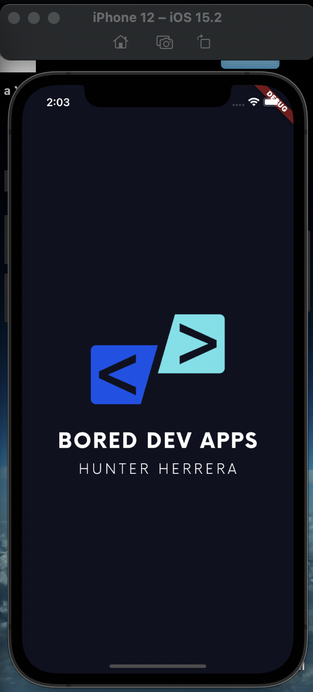
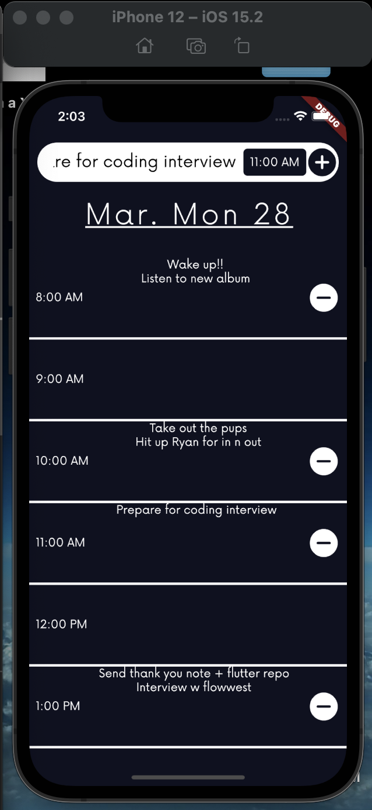
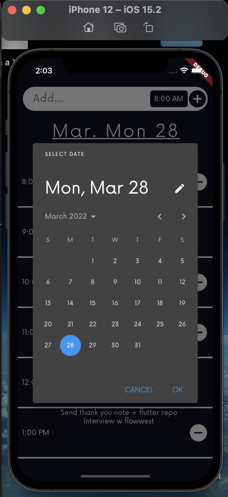

# Schedule App

This app utilizes Google's Dart framework Flutter, for cross-platfrom mobile development.

## Backend
The database supporting this app is Firebase Firestore, and uses an anonymous login by a persisted uid handle for each user. From which it GETS, SETS, & PUTS schedule data.

Please note this app will not run without a respoective GoogleService-Info.plist file for Firebase integration.

## Frontend
The lib/logic folder handles all business logic with the bloc package which acts similiarly to React's Redux

The lib/presentation folder handles the mobile application as well as front-end

## Screenshots

